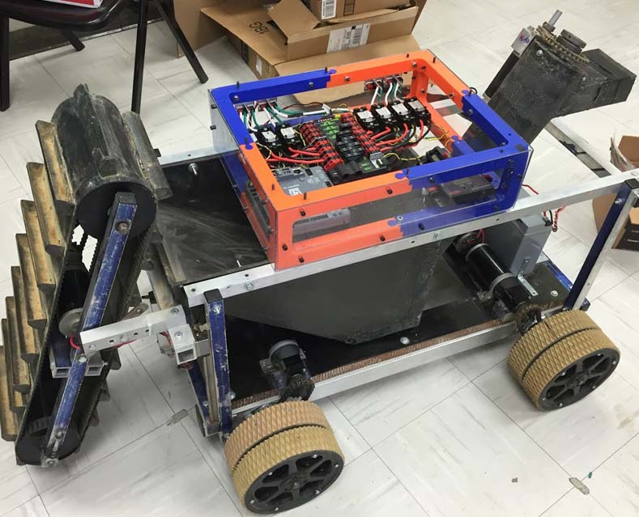

# NASA-RMC-2015-2016
</img>
Auburn University competes in NASA's Robotic Mining Competition.  The team which is a part of Space Club and affiliated with SPARC designs, builds, and programs a robot that excavates the simulated basaltic regolith and the ice on a small arena.  The team competed at the Kennedy Space and Rocket Center against colleges and universities across the nation.

For a video of the competition please visit this link:
https://www.youtube.com/watch?v=0mJE0ONVJBg&ab_channel=ThaddeusRoppel
